# NVIDIA Nsight Compute

[ncu下载](https://developer.nvidia.com/tools-overview/nsight-compute/get-started)  

[User Guide](https://docs.nvidia.com/nsight-compute/)

 [NsightComputeCli](https://docs.nvidia.com/nsight-compute/NsightComputeCli/index.html) 

[ProfilingGuide](https://docs.nvidia.com/nsight-compute/ProfilingGuide/index.html) 

[nsightCompute](https://docs.nvidia.com/nsight-compute/NsightCompute/index.html)

**主要功能**

- **内核剖析**：提供每个CUDA内核的执行时间、内存带宽、指令吞吐量等详细指标。
- **优化建议**：根据内核的执行效率，提供具体的优化建议，如内存访问优化、指令调度优化等。
- **调试支持**：支持内核调试，帮助开发者定位和修复代码中的错误。

[相关指令信息](../data/ncu_help)

## General Options

| 参数 | 说明 |
|------|------|
| `-h, --help` | 打印帮助信息 |
| `-v, --version` | 打印版本号 |
| `--mode` | 交互模式：launch-and-attach, launch, attach |
| `-p, --port` | 连接目标应用的端口，默认49152 |
| `--max-connections` | 最大连接数，默认64 |
| `--config-file` | 配置文件名，默认1（搜索当前目录和$HOME/.config/NVIDIA Corporation） |
| `--config-file-path` | 覆盖配置文件的默认路径 |

```shell
# 基础采集
sudo /usr/local/cuda/bin/ncu -o ncu_profile ./GEMM/profile_cuda_gemm_fp32

# 使用指定配置文件  config.ncu-cfg
config.ncu-cfg 如下：
[Launch-and-attach]
-c = 1
--section = LaunchStats, Occupancy
[Import]
--open-in-ui
-c = 1
--section = LaunchStats, Occupancy

sudo /usr/local/cuda/bin/ncu --config-file=1 ./GEMM/profile_cuda_gemm_fp32
```

## MPS Options

MPS (Multi-Process Service) 是 CUDA 的多进程服务，允许多个 CPU 进程共享同一个 GPU 上下文，减少 GPU 上下文切换开销，提高 GPU 利用率。

**为什么用 MPS？**
- 传统模式：每个 CUDA 进程独立创建 GPU 上下文，上下文切换有开销
- MPS 模式：多个进程共享 GPU 上下文，避免各自创建上下文的开销
- 适用场景：多进程推理、容器环境、多租户云服务器

| 参数 | 说明 |
|------|------|
| `--mps` | MPS行为：none, client, primary-client, control |
| `--mps-num-clients` | MPS客户端进程数 |
| `--mps-timeout` | 发现MPS客户端进程的超时时间（秒） |

**MPS 模式说明：**
| 模式 | 说明 |
|------|------|
| `none` | 不使用MPS（默认） |
| `client` | 作为MPS客户端运行，连接到现有的MPS服务器 |
| `primary-client` | 作为MPS主客户端，启动MPS服务器 |
| `control` | 作为MPS控制进程，仅启动服务器 |


## Launch Options

| 参数 | 说明 |
|------|------|
| `--check-exit-code` | 检查应用退出码，默认1（开启） |
| `--forward-signals` | 转发所有信号给应用根进程 |
| `--injection-path-32` | 32位注入库路径 |
| `--injection-path-64` | 64位注入库路径 |
| `--preload-library` | 预加载共享库 |
| `--call-stack` | 启用CPU调用栈收集 |
| `--call-stack-type` | 调用栈类型：native(默认), python |
| `--nvtx` | 启用NVTX支持 |
| `--support-32bit` | 支持从32位应用启动的分析 |
| `--target-processes` | 目标进程：application-only, all |
| `--target-processes-filter` | 进程过滤器：`<process name>`, `regex:<expression>`, `exclude:<name>`, `exclude-tree:<name>` |
| `--null-stdin` | 使用/dev/null作为标准输入 |
| `--nvtx-push-pop-scope` | NVTX push/pop范围：thread(默认), process |

```shell
# MPI分析所有进程
ncu --target-processes all -o ncu_target_processes mpirun -np 4 ./GEMM/profile_cuda_gemm_fp32

# 每个进程一个报告文件（联动File Options）
mpirun -np 4 ncu -o ncu_%q{OMPI_COMM_WORLD_RANK} ./GEMM/profile_cuda_gemm_fp32

# 收集CPU调用栈（联动Common Profile Options） (-g)
sudo /usr/local/cuda/bin/ncu --call-stack --call-stack-type=native -o ncu_call_stack_type_native_debug ./GEMM/profile_cuda_gemm_fp32

# 启用NVTX支持（联动Filter Profile Options）
sudo /usr/local/cuda/bin/ncu --nvtx --nvtx-include="*Region*"  -o ncu_nvtx_include ./profile_demo/nvtx_demo

# NVTX域过滤
ncu --nvtx --nvtx-domain-include="TrainingDomain" -o ncu_nvtx_domain_include ./profile_demo/nvtx_demo

# NVTX push/pop范围
sudo /usr/local/cuda/bin/ncu --nvtx --nvtx-push-pop-scope=process -o ncu_nvtx_push_pop ./profile_demo/nvtx_demo

# 进程过滤（正则匹配）
sudo /usr/local/cuda/bin/ncu --target-processes-filter=regex:profile_cuda_gemm_fp32.* -o ncu_target_processes_filter_reg ./GEMM/profile_cuda_gemm_fp32

# 排除进程树
sudo /usr/local/cuda/bin/ncu --target-processes-filter=exclude-tree:spawner -o ncu_target_processes_filter_exc ./GEMM/profile_cuda_gemm_fp32

# 禁用退出码检查（应用返回非0时继续）
sudo /usr/local/cuda/bin/ncu --check-exit-code=0 -o ncu_check_exit_code ./profile_demo/basic

# 转发信号给应用
sudo /usr/local/cuda/bin/ncu --forward-signals -o ncu_forward_signals ./profile_demo/basic 5

# 预加载CUDA库
ncu --preload-library=libcupti.so ./GEMM/profile_cuda_gemm_fp32

# 使用/dev/null作为标准输入
sudo /usr/local/cuda/bin/ncu --null-stdin -o ncu_null_stdin ./profile_demo/basic 5
```

## Attach Options

| 参数 | 说明 |
|------|------|
| `--hostname` | 连接目标的hostname或IP地址 |

## Common Profile Options

| 参数 | 说明 |
|------|------|
| `--kill` | 分析指定数量后终止应用，默认0（不终止） |
| `--replay-mode` | 重放机制：kernel(默认), application, range, app-range |
| `--app-replay-buffer` | 应用重放缓冲区位置：file(默认), memory |
| `--app-replay-match` | 内核匹配策略：name, grid(默认), all |
| `--app-replay-mode` | 匹配模式：strict, balanced(默认), relaxed |
| `--graph-profiling` | CUDA图分析模式：node(默认), graph |
| `--range-replay-options` | 范围重放选项：enable-greedy-sync, disable-host-restore, disable-host-save, disable-dependent-kernel-detection |
| `--list-sets` | 列出所有section sets |
| `--set` | 要收集的section set标识符 |
| `--list-sections` | 列出所有sections |
| `--section-folder` | section文件的搜索路径（非递归） |
| `--section-folder-recursive` | section文件的搜索路径（递归） |
| `--section-folder-restore` | 恢复stock文件到默认section文件夹 |
| `--list-rules` | 列出所有分析规则 |
| `--apply-rules` | 应用分析规则：on/off, yes/no |
| `--rule` | 要应用的分析规则标识符 |
| `--import-sass` | 导入ELF cubins到报告：on(默认)/off, yes/no |
| `--import-source` | 导入CUDA源文件：on/off, yes(默认)/no |
| `--source-folders` | CUDA源文件的搜索路径（递归） |
| `--list-metrics` | 列出所有要收集的指标 |
| `--query-metrics` | 查询可用指标 |
| `--query-metrics-mode` | 查询指标模式：base(默认), suffix, all |
| `--query-metrics-collection` | 查询指标类型：device, groups, launch, numa, nvlink, pmsampling, profiling(默认), source, stats, warpsampling |
| `--list-chips` | 列出所有支持的芯片 |
| `--chips` | 指定查询指标的芯片 |
| `--profile-from-start` | 从应用开始分析：on(默认)/off, yes/no |
| `--disable-profiler-start-stop` | 禁用cu(da)ProfilerStart/Stop API |
| `--quiet` | 抑制所有分析器输出 |
| `--verbose` | 增加分析器输出详细度 |
| `--cache-control` | GPU缓存行为：all, none |
| `--clock-control` | GPU时钟控制：base(锁定到基础频率), none(不锁定), reset(重置时钟并退出) |
| `--pipeline-boost-state` | Tensor Core boost状态：stable(默认), dynamic |

```shell
# 查询所有可用指标
sudo /usr/local/cuda/bin/ncu --query-metrics

# 查询指标组
ncu --query-metrics-collection=groups

# 查询指标和事件的采集模式 base(默认), suffix, all
sudo /usr/local/cuda/bin/ncu --query-metrics-mode=all  

# 列出所有分析集
ncu --list-sets

# 列出所有section
ncu --list-sections

# 列出所有分析规则
ncu --list-rules

# 列出所有支持的芯片
ncu --list-chips

# 查询指定芯片的指标
ncu --chips=ga100 --query-metrics

# 基本分析集（默认）
sudo /usr/local/cuda/bin/ncu -k gemm_v00 --set basic -o ncu_set_basic ./GEMM/profile_cuda_gemm_fp32

# 详细分析集（联动Filter Profile Options的--section）
sudo /usr/local/cuda/bin/ncu  -k gemm_v00 --set detailed --section=MemoryWorkloadAnalysis \
-o ncu_set_detailed ./GEMM/profile_cuda_gemm_fp32

# 完整分析集
sudo /usr/local/cuda/bin/ncu --set full -o ncu_set_full ./GEMM/profile_cuda_gemm_fp32

# PM采样分析集
sudo /usr/local/cuda/bin/ncu --set pmsampling -o ncu_set_pmsampling ./GEMM/profile_cuda_gemm_fp32

# 屋顶线分析集
sudo /usr/local/cuda/bin/ncu --set roofline -o ncu_set_roofline ./GEMM/profile_cuda_gemm_fp32

# NVLink分析（多GPU场景）
sudo /usr/local/cuda/bin/ncu --set nvlink  -o ncu_set_nvlink ./GEMM/profile_cuda_gemm_fp32

# 分析前3个kernel后终止
sudo /usr/local/cuda/bin/ncu --launch-count=3 --kill=1 -o ncu_launch_3_kill ./GEMM/profile_cuda_gemm_fp32

# 重放模式
sudo /usr/local/cuda/bin/ncu \
    --replay-mode=application \
    --app-replay-mode=strict \
    --app-replay-match=grid \
    -o ncu_app_replay \
    ./GEMM/profile_cuda_gemm_fp32
  
sudo /usr/local/cuda/bin/ncu  --replay-mode=kernel  -o ncu_replay_mode_kernel ./profile_demo/basic 5

# CUDA图分析
ncu --graph-profiling=node ./GEMM/profile_cuda_gemm_fp32  # 节点级别（默认）
ncu --graph-profiling=graph ./GEMM/profile_cuda_gemm_fp32  # 图级别

# 测试kernel执行时间（禁用缓存和时钟控制）
sudo /usr/local/cuda/bin/ncu --cache-control=none --clock-control=none --metrics gpu__time_duration.sum -o ncu_metrics_gpu_time ./profile_demo/basic 5

# 锁定GPU基础频率（稳定测试）
sudo /usr/local/cuda/bin/ncu --clock-control=base -o ncu_clock_control_base ./GEMM/profile_cuda_gemm_fp32

# Tensor Core boost
sudo /usr/local/cuda/bin/ncu --pipeline-boost-state=stable -o ncu_pipeline_stable ./GEMM/profile_cuda_gemm_fp32  # 稳定（默认）

# 应用分析规则（联动Filter Profile Options的--rule）
sudo /usr/local/cuda/bin/ncu --apply-rules=on --rule=memory_bound -o ncu_rules_momory ./profile_demo/basic 5

# 应用多个规则
sudo /usr/local/cuda/bin/ncu --apply-rules=on --rule=memory_bound,compute_bound \
    -o ncu_rules_momory_copmpute ./profile_demo/basic 5

# 从应用开始分析，跳过初始化
sudo /usr/local/cuda/bin/ncu --profile-from-start=off \
    -o ncu_profiler_form_start_off ./profile_demo/activity_trace_async cudaprofilerapi

# 禁用ProfilerStart/Stop API
sudo /usr/local/cuda/bin/ncu --disable-profiler-start-stop \
    -o ncu_disable_profiler_start_stop ./profile_demo/activity_trace_async cudaprofilerapi

# 抑制分析器输出
sudo /usr/local/cuda/bin/ncu --quiet -o ncu_quiet ./profile_demo/basic 5

# 增加输出详细度
sudo /usr/local/cuda/bin/ncu  --verbose -o ncu_verbose ./profile_demo/basic 5

# 导入SASS
sudo /usr/local/cuda/bin/ncu  --import-sass=on -o ncu_import_sass ./GEMM/profile_cuda_gemm_fp32

# 导入CUDA源码  -lineinfo
sudo /usr/local/cuda/bin/ncu --import-source=on -o ncu_import_source ./GEMM/profile_cuda_gemm_fp32

# 指定源文件搜索路径 -lineinfo
sudo /usr/local/cuda/bin/ncu  --import-source=on --source-folders=../GEMM/src \
    -o ncu_source_folders ./GEMM/profile_cuda_gemm_fp32

# 指定section搜索路径
ncu --section-folder-recursive=/path/to/sections ./GEMM/profile_cuda_gemm_fp32

# 恢复默认section文件夹
ncu --section-folder-restore
```

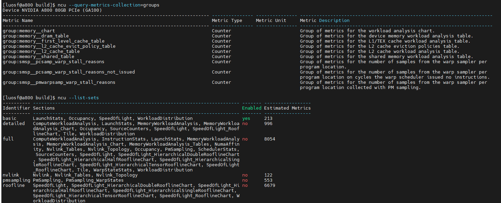

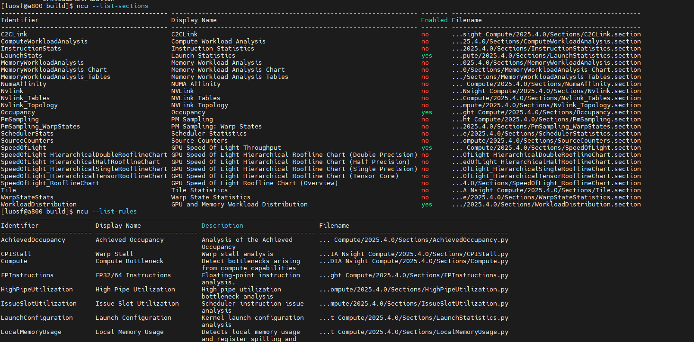

section是指一组 metrics，如果未指定section,则按照与默认的set关联的section来收集计数器的信息。

**可用的配置集（set）：**

| 配置集 | 包含的Section | 指标数量 | 说明 |
|--------|--------------|---------|------|
| **basic** | LaunchStats, Occupancy, SpeedOfLight, WorkloadDistribution | 213 | 基础分析（默认启用） |
| **detailed** | ComputeWorkloadAnalysis, LaunchStats, MemoryWorkloadAnalysis, Occupancy, SourceCounters, SpeedOfLight, Tile等 | 996 | 详细分析，包含内存和计算分析 |
| **full** | 包含所有section（ComputeWorkloadAnalysis, MemoryWorkloadAnalysis, Occupancy, PmSampling, SchedulerStats, SourceCounters, SpeedOfLight, WarpStateStats等） | 8054 | 完整分析，收集所有指标 |
| **nvlink** | Nvlink, Nvlink_Tables, Nvlink_Topology | 122 | NVLink拓扑和带宽分析 |
| **pmsampling** | PmSampling, PmSampling_WarpStates | 553 | PM采样分析，用于 warp 状态统计 |
| **roofline** | SpeedOfLight, SpeedOfLight_HierarchicalSingleRooflineChart, SpeedOfLight_HierarchicalDoubleRooflineChart, SpeedOfLight_HierarchicalHalfRooflineChart, SpeedOfLight_HierarchicalTensorRooflineChart, WorkloadDistribution | 6679 | 屋顶线(Roofline)模型分析 |

**常用section说明：**

| Section | 说明 |
|---------|------|
| **SpeedOfLight** | GPU计算和内存带宽的理论利用率（SOL指标） |
| **MemoryWorkloadAnalysis** | 内存访问模式分析（合并访存、带宽利用率） |
| **ComputeWorkloadAnalysis** | 计算工作负载分析（指令吞吐量、SM利用率） |
| **Occupancy** | GPU占用率分析 |
| **LaunchStats** | 内核启动统计 |
| **SchedulerStats** | 调度器统计（活跃/非活跃warp） |
| **WarpStateStats** | Warp状态统计（停顿原因、分支发散） |
| **SourceCounters** | 源级计数器（按源代码行统计） |

## Filter Profile Options

| 参数 | 说明 |
|------|------|
| `--devices` | 启用的设备ID列表（逗号分隔） |
| `--filter-mode` | 过滤模式：global(默认), per-gpu, per-launch-config |
| `--kernel-id` | 内核标识符，格式：`context-id:stream-id:[name-operator:]kernel-name:invocation-nr` |
| `-k, --kernel-name` | 内核名称过滤：`<kernel name>` 或 `regex:<expression>` |
| `--kernel-name-base` | 内核名称基准：function(默认), demangled, mangled |
| `--rename-kernels` | 重命名内核：on(默认)/off, yes/no |
| `--rename-kernels-export` | 导出重命名配置到文件 |
| `--rename-kernels-path` | 重命名配置文件的路径 |
| `-c, --launch-count` | 限制收集的分析结果数量 |
| `-s, --launch-skip` | 开始分析前跳过的内核启动次数，默认0 |
| `--launch-skip-before-match` | 开始分析前跳过的所有内核启动次数，默认0 |
| `--section` | 收集的section标识符，支持regex匹配 |
| `--metrics` | 指定要收集的指标（逗号分隔），支持regex:, group:, breakdown:前缀 |
| `--disable-extra-suffixes` | 禁用额外后缀收集（avg, min, max, sum） |
| `--nvtx-include` | NVTX包含过滤器 |
| `--nvtx-exclude` | NVTX排除过滤器 |
| `--range-filter` | NVTX范围过滤器，格式：`<yes/no/on/off>:<start/stop范围实例>:<NVTX范围实例>` |
| `--native-include` | 本地CPU调用栈包含过滤器 |
| `--native-exclude` | 本地CPU调用栈排除过滤器 |
| `--python-include` | Python调用栈包含过滤器 |
| `--python-exclude` | Python调用栈排除过滤器 |

```shell
# 过滤特定内核
sudo /usr/local/cuda/bin/ncu  -k vector_add -o ncu_k_vector_add ./profile_demo/basic 5

# 正则过滤内核名
sudo /usr/local/cuda/bin/ncu -k regex:.*vector_add.* -o ncu_k_regex ./profile_demo/basic 5

# 内核名称基准
sudo /usr/local/cuda/bin/ncu -k vector_add --kernel-name-base=function \
    -o ncu_k_kernel_name ./profile_demo/basic 5  # 函数名（默认）

# 只分析第3-10次启动
sudo /usr/local/cuda/bin/ncu -k vector_add -s 2 -c 8 -o ncu_k_s_2_c_8 ./profile_demo/basic 12

# 跳过前5次所有内核启动
sudo /usr/local/cuda/bin/ncu --launch-skip-before-match=5 \
    -o ncu_launch_skip_before_match_5 ./profile_demo/basic 12

# 分析特定GPU的所有内核
sudo /usr/local/cuda/bin/ncu --devices 0 -o ncu_devices_0 ./profile_demo/basic 5

# 过滤模式
sudo /usr/local/cuda/bin/ncu --filter-mode=global -o ncu_filter_mode_global ./profile_demo/basic 5  # 全局（默认）

# 按内核ID过滤:第1个上下文中第20流上第5次启动的 gemm_v00 内核
sudo /usr/local/cuda/bin/ncu --kernel-id=1:20:gemm_v00:5 -o ncu_kernel_id ./GEMM/profile_cuda_gemm_fp32


# l1tex__t_bytes_pipe_lsu_mem_global_op_ld.sum.per_second：load带宽测试，nvprof 对应 gld_throught
# l1tex__t_bytes_pipe_lsu_mem_global_op_st.sum.per_second：store带宽测试，nvprof 对应 gst_throught
# l1tex__t_sectors_pipe_lsu_mem_global_op_ld.sum：读取global memory时transcation的总数量
# smsp__sass_average_data_bytes_per_sector_mem_global_op_ld.pct：读取global memory时的效率
# dram__bytes_read.sum.per_second：load带宽测试，nvprof 对应 dram_read_throughput
# dram__bytes_write.sum.per_second：store带宽测试，nvprof 对应 dram_write_throughput
# lts__t_sector_hit_rate.pct：L2 cache的命中率
# lts__t_sectors_srcunit_tex_op_read.sum.per_second：L2 cache的读带宽：单位是sector/ns,每个sector应该是32B大小
# 查询某个指标含义 sudo /usr/local/cuda/bin/ncu --query-metrics | grep -A5 -B2 "l1tex__t_bytes_pipe_lsu_mem_global_op_l
sudo /usr/local/cuda/bin/ncu \
    --metrics \
l1tex__t_bytes_pipe_lsu_mem_global_op_ld.sum.per_second,\
l1tex__t_bytes_pipe_lsu_mem_global_op_st.sum.per_second,\
l1tex__t_sectors_pipe_lsu_mem_global_op_ld.sum,\
smsp__sass_average_data_bytes_per_sector_mem_global_op_ld.pct,\
dram__bytes_read.sum.per_second,\
dram__bytes_write.sum.per_second,\
lts__t_sector_hit_rate.pct,\
lts__t_sectors_srcunit_tex_op_read.sum.per_second \
    ./profile_demo/basic 1


# 禁用额外后缀（只收集.sum等）
sudo /usr/local/cuda/bin/ncu  --disable-extra-suffixes -o ncu_disable_extra_suffixes ./profile_demo/basic 1

# 重命名内核
ncu --rename-kernels=on ./profile_demo/basic 1

# 导出重命名配置
ncu --rename-kernels-export=/path/to/rename.json ./GEMM/profile_cuda_gemm_fp32

# 使用重命名配置
ncu --rename-kernels-path=/path/to/rename.json ./GEMM/profile_cuda_gemm_fp32

# 指定收集的section
sudo /usr/local/cuda/bin/ncu --section=SpeedOfLight -o ncu_section_SpeedOfLight ./GEMM/profile_cuda_gemm_fp32
sudo /usr/local/cuda/bin/ncu --section=regex:.*Workload.* -o ncu_section_regex ./GEMM/profile_cuda_gemm_fp32 
```

## PM Sampling Options

| 参数 | 说明 |
|------|------|
| `--pm-sampling-interval` | PM采样间隔（周期或ns），0表示自动确定 |
| `--pm-sampling-buffer-size` | PM采样缓冲区大小（字节），0表示自动确定 |
| `--pm-sampling-max-passes` | PM采样最大pass数，0表示自动确定 |

```shell
# 完整PM采样配置,PM采样详细分析--set pmsampling; 自定义采样间隔;指定缓冲区大小;最大pass数
sudo /usr/local/cuda/bin/ncu \
    --set pmsampling \
    --pm-sampling-interval=50 \
    --pm-sampling-buffer-size=67108864 \
    --pm-sampling-max-passes=10 \
    -o ncu_set_pmsampling_all ./GEMM/profile_cuda_gemm_fp32
```

## Warp State Sampling Options

| 参数 | 说明 |
|------|------|
| `--warp-sampling-interval` | Warp状态采样周期[0-31]，实际频率2^(5+value)，默认auto |
| `--warp-sampling-max-passes` | Warp状态采样最大pass数，默认5 |
| `--warp-sampling-buffer-size` | Warp状态采样缓冲区大小（字节），默认33554432 |

```shell
# 完整Warp采样配置
sudo /usr/local/cuda/bin/ncu \
    --set detailed \
    --warp-sampling-interval=5 \
    --warp-sampling-max-passes=10 \
    --warp-sampling-buffer-size=67108864 \
    -o ncu_set_detailed_warp_all ./GEMM/profile_cuda_gemm_fp32
```

## File Options

| 参数 | 说明 |
|------|------|
| `--log-file` | 输出日志文件路径，stdout/stderr表示标准输出/错误 |
| `-o, --export` | 输出文件路径，不设置则使用临时文件 |
| `-f, --force-overwrite` | 强制覆盖所有输出文件 |
| `-i, --import` | 输入文件路径，用于读取分析结果 |
| `--open-in-ui` | 在UI中打开报告而非终端显示 |

```shell

# 从文件读取报告分析
ncu --import my_report.ncu-rep

# 从文件读取并在UI中打开
ncu --import my_report.ncu-rep --open-in-ui

# 只打开UI查看报告
ncu-ui my_report.ncu-rep

# 保存日志到文件
ncu --log-file=ncu.log ./GEMM/profile_cuda_gemm_fp32
```

## Console Output Options

| 参数 | 说明 |
|------|------|
| `--csv` | 使用逗号分隔值输出 |
| `--page` | 报告页面：details(默认), raw, source, session |
| `--print-source` | 源视图：sass, ptx, cuda, cuda,sass |
| `--resolve-source-file` | 源文件路径列表（逗号分隔） |
| `--print-details` | details页面输出内容：header(默认), body, all |
| `--print-metric-name` | 指标名称列显示：label(默认), name, label-name |
| `--print-units` | 指标单位缩放：auto(默认), base |
| `--print-metric-attribution` | 显示Green Context结果的归因级别 |
| `--print-fp` | 所有数值指标显示为浮点数 |
| `--print-kernel-base` | 内核名称输出基准：demangled(默认) |
| `--print-metric-instances` | 指标实例值输出模式：none(默认), values, details |
| `--print-nvtx-rename` | NVTX重命名方式：none(默认), kernel |
| `--print-rule-details` | 打印规则结果的附加详情 |
| `--print-summary` | 摘要输出模式：none, per-gpu, per-kernel, per-nvtx |

```shell
# CSV格式输出（便于数据分析）
sudo /usr/local/cuda/bin/ncu  --csv  ./profile_demo/basic 1

# 显示详细信息
sudo /usr/local/cuda/bin/ncu  --page=details --print-details=all ./profile_demo/basic 1

# 显示源视图
sudo /usr/local/cuda/bin/ncu  --page=source --print-source=sass ./profile_demo/basic 1

# 显示SASS汇编和CUDA源码
sudo /usr/local/cuda/bin/ncu  --page=source --print-source=sass,cuda ./GEMM/profile_cuda_gemm_fp32 

# 只显示指标名称
sudo /usr/local/cuda/bin/ncu  --print-metric-name=label ./profile_demo/basic 1

# 浮点数格式显示
sudo /usr/local/cuda/bin/ncu  --print-fp ./profile_demo/basic 1

# 显示所有指标实例值
sudo /usr/local/cuda/bin/ncu  --print-metric-instances=none ./profile_demo/basic 1  # 默认

# 按内核汇总输出
sudo /usr/local/cuda/bin/ncu  --print-summary=per-kernel ./profile_demo/basic 1

# 显示规则详情
sudo /usr/local/cuda/bin/ncu --print-rule-details ./profile_demo/basic 1

# 单位缩放
sudo /usr/local/cuda/bin/ncu --print-units=auto ./profile_demo/basic 1  # 默认

# 显示Green Context归因
sudo /usr/local/cuda/bin/ncu --print-metric-attribution ./profile_demo/basic 1

# 详细CSV报告
sudo /usr/local/cuda/bin/ncu  --csv --print-details=all --print-metric-instances=details \
    --print-metric-name=name -o ncu_csv_print_details_metrics ./GEMM/profile_cuda_gemm_fp32
```

## 常用分析流程

```shell
# 完整分析集
sudo /usr/local/cuda/bin/ncu --set full -o ncu_set_full ./GEMM/profile_cuda_gemm_fp32

sudo /usr/local/cuda/bin/ncu -k gemm_v00 -s 2 -c 1 --page=details --print-details=all ./GEMM/profile_cuda_gemm_fp32

sudo /usr/local/cuda/bin/ncu --kernel-id=1:20:gemm_v00:5 -o ncu_kernel_id ./GEMM/profile_cuda_gemm_fp32
```

## 显示介绍

ncu 生成的分析报告包含丰富的信息，学会解读这些数据是性能调优的关键。

### 阅读建议（按使用阶段）

- **快速定位瓶颈**：`Summary → SpeedOfLight → Roofline`
- **判断瓶颈成因**：`Memory / Compute Workload Analysis`
- **确认是否 stall**：`SchedulerStats → WarpStateStats`
- **定位代码位置**：`SourceCounters → Source`
- **验证是否代表性问题**：`Statistics / PM Sampling`

### 报告结构概览

ncu 报告分为三个主要页面：

| 页面 | 说明 | 主要用途 |
|------|------|----------|
| **Summary** | 内核汇总列表 | 快速定位最耗时的内核 |
| **Details** | 详细指标数据 | 深度分析性能瓶颈 |
| **Source** | 源代码关联 | 定位到具体代码行 |

### Summary 页面

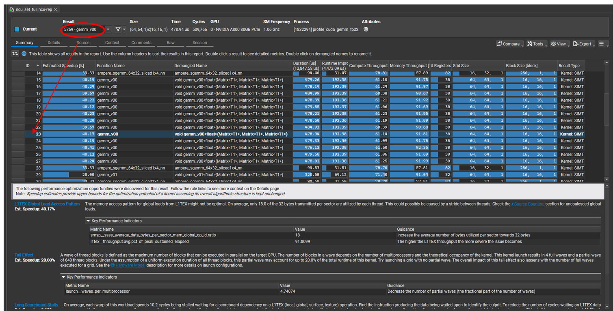

Summary 页面展示所有被分析内核的概览信息：（Result位置选择后对应列表显示阴影，或者表格中双击该位置也会自动跳转）

可悬浮鼠标在指标位置显示具体信息，并且可以钉住。

summary下半部分诊断信息：

* `L1TEX Global Load Access Pattern`：全局内存访问合并效率偏低（sector 利用率不足）
* `Tail Effect`：grid/block 配置导致 wave 数不能整除 SM，存在部分 wave 空转（参考 [LaunchStatistics](####Launch Statistics（启动配置）)）
* `long Scoreboard Stalls` : warp 在等 L1TEX 数据

| 字段 | 说明 |
|------|------|
| **ID** | 每个内核的唯一标识符 |
| **Function Name** | 内核函数名称 |
| **Demangled Name** | 去修饰后的函数名 |
| **Duration** | 内核执行时间（ns） |
| **Estimated Speedup** | 预估加速比（假设对应瓶颈被完全消除的理论上限） |
| **Compute Throughput** | SM 计算吞吐量利用率 |
| **Memory Throughput** | 内存带宽利用率 |
| **Registers/Thread** | 每个线程使用的寄存器数 |
| **Grid Size** | 网格大小（block 数） |
| **Block Size** | 块大小（thread 数） |

**使用技巧：**
- 按 Duration 排序，快速定位最慢的内核
- Estimated Speedup 高的内核优先优化
- Compute/Memory Throughput 失衡说明存在瓶颈

### Details 页面

```shell
ncu --import ./ncu_set_full.ncu-rep --kernel-id :::28 # 5777-gemm_v00 在ui中显示是27，所以第28个kernel
ncu --import ./ncu_set_full.ncu-rep --kernel-id :::28 --page=details
```

Details 页面是性能分析的核心，包含多个 section，每个 section 聚焦特定方面的指标。

#### GPU Speed Of Light Throughput（核心瓶颈定位）

```shell
ncu --list-sections
ncu --import ./ncu_set_full.ncu-rep --kernel-id :::28 --section=SpeedOfLight
```

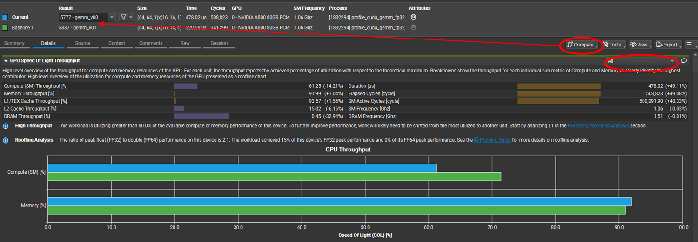

这是**最重要的 section**，首先查看这里判断瓶颈类型：

**快速判断瓶颈：**

| Memory > 80% | Compute > 80% | 结论 |
|--------------|---------------|------|
| 91.99% | 61.25% | **内存受限** |
| 30% | 90% | **计算受限** |
| 85% | 85% | **平衡** |

**内存层次结构分析：**

| 层级 | 利用率 | 状态 | 含义 |
|------|--------|------|------|
| L1/TEX | 93.57% | 🔴 饱和 | L1 高频访问成为瓶颈 |
| L2 | 15.02% | 🟢 空闲 | 大部分访问命中 L1 |
| DRAM | 0.45% | 🟢 空闲 | 数据重用性好 |

**本例分析：**

- L1 高但 DRAM 低 → 数据局部性不错，但 L1 访问本身成为瓶颈
- 优化方向：减少全局内存访问、增加共享内存复用

##### Throughput Breakdown（计算指令分解，内存访问路径）


#####  Roofline

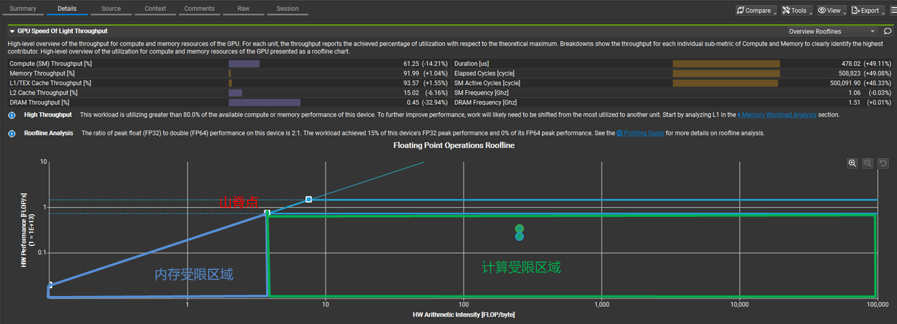

Roofline 图通过算术强度（FLOP/Byte）与硬件峰值对比，判断 kernel 当前是 **内存受限还是计算受限**，并明确其 **距离理论上限的结构性限制与可优化空间**。

- **上方的水平线**：**单精度（FP32）峰值性能**
- **下方的水平线**：**双精度（FP64）峰值性能**

kernel 的位置决定优化方向：左移解决访存，右移堆计算，上移减少 stall。

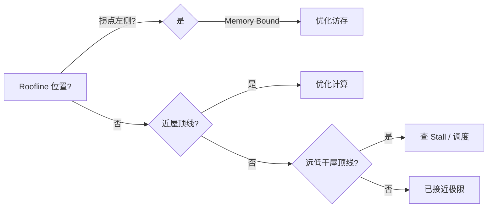

####  PM Sampling

```shell
ncu --import ./ncu_set_full.ncu-rep --kernel-id :::28 --section=PmSampling
```

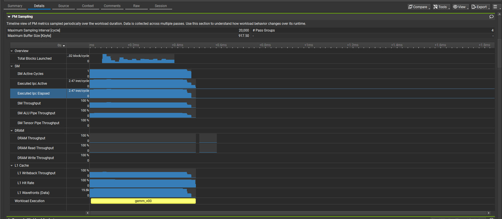

| 指标                      | 数值         | 解读           |
| ------------------------- | ------------ | -------------- |
| Maximum Buffer Size       | 917.50 KB    | 采样缓冲区大小 |
| Maximum Sampling Interval | 20,000 cycle | 采样间隔       |
| # Pass Groups             | 4            | 采样轮次       |

#### Compute Workload Analysis

```shell
ncu --import ./ncu_set_full.ncu-rep --kernel-id :::28 --section=ComputeWorkloadAnalysis
```

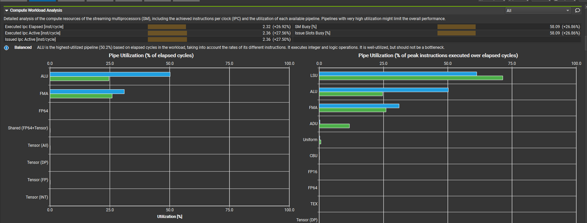

```shell
ncu --query-metrics-mode suffix --metrics sm__inst_executed --chip ga100 # 查看指标含义
sm__inst_executed.avg.per_cycle_active
```

| 指标                 | 数值   | 解读                         |
| -------------------- | ------ | ---------------------------- |
| Executed Ipc Active  | 2.36   | 每个活跃周期执行 2.36 条指令 |
| Executed Ipc Elapsed | 2.32   | 整体 IPC 略低于活跃期        |
| Issue Slots Busy     | 58.09% | 指令发射槽利用率             |
| SM Busy              | 58.09% | SM 忙碌程度                  |

[Interpreting compute workload analysis in Nsight Compute ](https://stackoverflow.com/questions/61413176/interpreting-compute-workload-analysis-in-nsight-compute),    [what is IPC(Instructions Per Cycle)](https://forums.developer.nvidia.com/t/what-is-ipc-instructions-per-cycle/66138)

#### Memory Workload Analysis

```shell
ncu --import ./ncu_set_full.ncu-rep --kernel-id :::28 --section=MemoryWorkloadAnalysis
```


逻辑单元以绿色（活跃）或灰色（非活跃）表示。

物理单元以蓝色（活跃）或灰色（非活跃）表示。 

| 缩写 | 全称                                    | 功能                                  |
| :--- | :-------------------------------------- | :------------------------------------ |
| ICC  | Instruction Constant Cache 指令常量缓存 | 缓存指令，服务TPC内所有SM             |
| IMC  | Immediate Constant Cache                | 通过立即数常量引用访问的常量数据      |
| IDC  | Indexed Constant Cache 索引常量缓存     | 通过LDC指令访问的常量数据缓存         |
| GCC  | GPC Constant Cache                      | 缓存常量数据和指令，作为TPC缓存的上层 |

#### Scheduler Statistics (调度器统计)

```shell
ncu --import ./ncu_set_full.ncu-rep --kernel-id :::28 --section=SchedulerStats
```

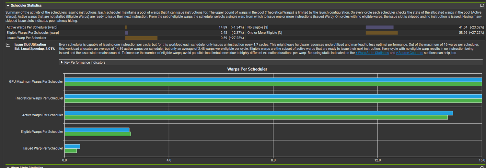

| 指标              | 数值   | 解读                                                         |
| ----------------- | ------ | ------------------------------------------------------------ |
| Active Warps/SM   | 14.89  | 活跃 warp 充足（max 16）                                     |
| Eligible Warps/SM | 2.48   | 只有 2.48 个随时可发射                                       |
| No Eligible       | 41.04% | 41% 的周期没有可发射的 warp<br /> 数据依赖或长延迟指令未被 ILP 或足够的 warp 数隐藏 |
| Issued Warp/cycle | 0.59   | 每周期发射 0.59 个 warp                                      |

#### Warp State Statistics (Warp 状态)

```shell
ncu --import ./ncu_set_full.ncu-rep --kernel-id :::28 --section=WarpStateStats
```
**warp state**: Unused 未使用 → Active活跃 → (Eligible就绪 ↔ Selected已选中) ↔ Stalled停滞
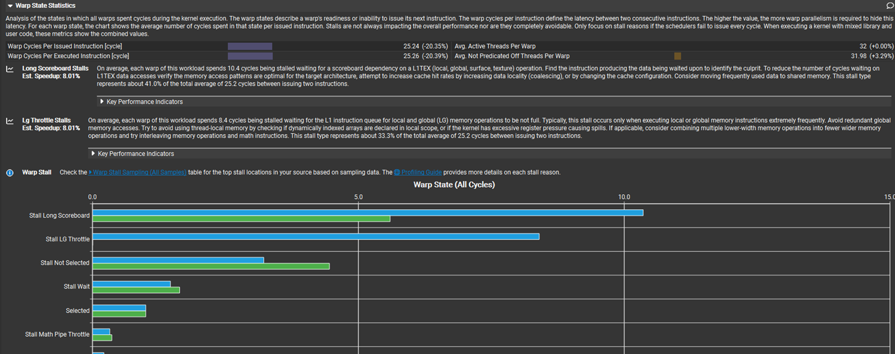

| 指标                                   | 值           | 含义                                         |
| -------------------------------------- | ------------ | -------------------------------------------- |
| **Warp Cycles Per Issued Instruction** | 25.24 cycles | 发射间隔 25.24 cycles                        |
| **Avg. Active Threads Per Warp**       | 32           | warp 完全满载，无分支发散（divergence-free） |
| **Avg. Not Predicated-Off Threads**    | 31.98        | 几乎所有线程都参与执行                       |

##### Typical Stall Reason

 按 stall 原因分类（概念层面）

| Stall 原因                      | 说明                                                   |
| ------------------------------- | ------------------------------------------------------ |
| 指令获取 (Instruction Fetch)    | GPU 等待获取下一条指令                                 |
| 内存依赖 (Memory Dependency)    | 当前指令需要前面内存操作的结果，未准备好就 stall       |
| 执行依赖 (Execution Dependency) | 当前指令依赖前一条指令的计算结果，前一条没完成就 stall |
| 管道忙 (Pipeline Busy)          | 执行单元繁忙，需要等待空闲管道                         |
| 同步/Barrier (Synchronization)  | 遇到线程同步（如 `__syncthreads()`）或 warp barrier    |

------

按 Nsight Compute stall 类型整理（硬件/指标层面）

| Stall 类型         | 可能原因 / 触发条件                                          |
| ------------------ | ------------------------------------------------------------ |
| Long Scoreboard    | L1Tex 结果依赖（Global、Local、Surface、Texture memory）     |
| Short Scoreboard   | Shared memory 结果依赖；频繁的 MUFU（特殊功能单元操作）；Dynamic branching |
| LG Throttle        | 等待 L1 指令队列未满（Local / Global 内存操作），极高频率访问 local/global 内存时出现 |
| MIO Throttle       | 等待 MIO 队列未满；极高频率 LDS、MUFU 或 Dynamic Branching 时出现 |
| Math Pipe Throttle | 等待执行单元（算术/数学管道）可用，管道忙造成的 stall        |

#### Instruction Statistics

```shell
ncu --import ./ncu_set_full.ncu-rep --kernel-id :::28 --section=InstructionStats
```

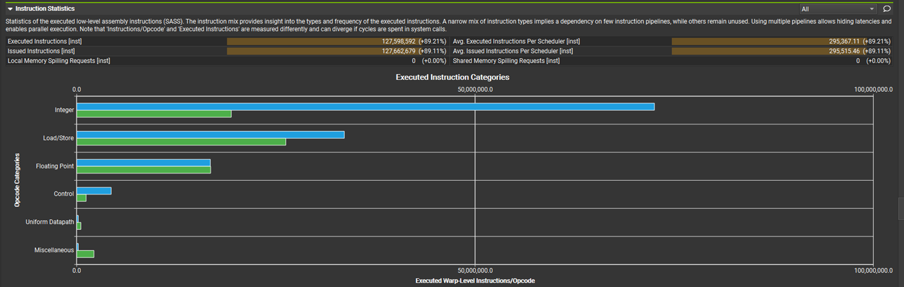

| 检查项                 | 结果 | 说明               |
| ---------------------- | ---- | ------------------ |
| Local Memory Spilling  | 0    | 无寄存器溢出       |
| Shared Memory Spilling | 0    | 无 shared mem 溢出 |
| Issued vs Executed     | 一致 | 指令正常执行       |

#### Launch Statistics（启动配置）

```shell
ncu --import ./ncu_set_full.ncu-rep --kernel-id :::28 --section=LaunchStats
```

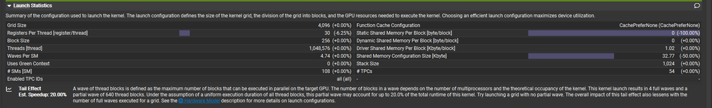

**[尾部效应 ](https://developer.nvidia.com/blog/cuda-pro-tip-minimize-the-tail-effect/)（Tail Effect）：** 每 wave 包含最多 `#SMs × max_blocks_per_SM` 个 blocks；当总 block 数不能被 `#SMs` 整除时，**最后一个 wave 无法填满所有 SM**，导致部分 SM 空闲等待，形成“尾部延迟”。

```shell
Theoretical Active Warps/SM: 64
Threads/SM = 64 × 32 = 2,048 线程
Blocks/SM = 2,048 / 256 = 8 blocks/SM
Wave Size = SMs × Blocks/SM = 108 × 8 = 864 blocks/wave
Total Waves = 4,096 / 864 = 4.74 waves = 4 full waves (3,456 blocks) + 0.74 partial wave (640 blocks)
```

优化：

* 优先增加线程块数量，使 grid 是 SM 的倍数来削弱影响
* [`__launch_bounds__`](http://docs.nvidia.com/cuda/cuda-c-programming-guide/index.html#launch-bounds) 限制寄存器数量

#### Occupancy（占用率分析）

```shell
ncu --import ./ncu_set_full.ncu-rep --kernel-id :::28 --section=Occupancy
```

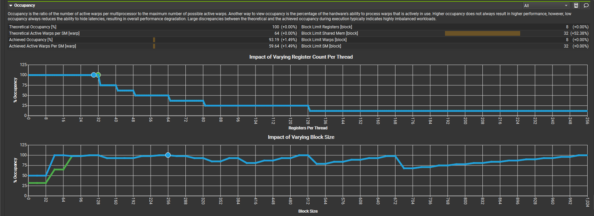

| 指标                             | 值          | 含义                         |
| -------------------------------- | ----------- | ---------------------------- |
| **Registers per Thread**         | 30          | 每线程寄存器用量             |
| **Block Limit: Registers**       | 8 blocks/SM | 寄存器限制最大 block 数      |
| **Block Limit: SM / Shared Mem** | 32          | SM 资源和 shared memory 充裕 |
| **Theoretical Occupancy**        | 100%        | 理论可达满载                 |
| **Achieved Occupancy**           | **93.19%**  | 实际占用率极高               |
| **Active Warps per SM**          | 59.64       | 接近理论最大值（64）         |

#### GPU and Memory Workload Distribution

```shell
ncu --import ./ncu_set_full.ncu-rep --kernel-id :::28 --section=WorkloadDistribution
```

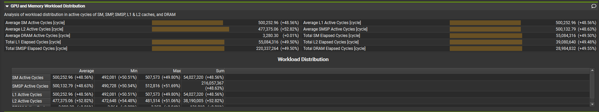


#### Source Counters（源代码级分析）

```shell
ncu --import ./ncu_set_full.ncu-rep --kernel-id :::28 --section=SourceCounters
```

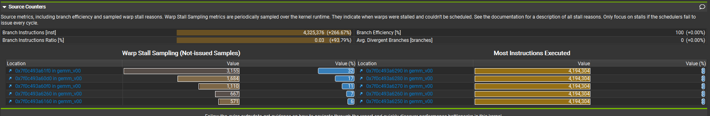

将性能指标关联到具体的源代码行，定位热点代码，可跳转到source 页面。

| 指标                          | 值        | 含义                                          |
| ----------------------------- | --------- | --------------------------------------------- |
| **Branch Instructions Ratio** | 0.03%     | 分支指令占比极低                              |
| **Branch Instructions**       | 4,325,376 | 总分支指令数                                  |
| **Branch Efficiency**         | 100%      | 所有分支在 warp 内完全一致，无 divergent 执行 |
| **Avg. Divergent Branches**   | 0         | 无任何 warp 出现分支分歧                      |

### source page

```shell
ncu --import ./ncu_import_source.ncu-rep --kernel-id :::28 --page=source
ncu --import ./ncu_import_source.ncu-rep --kernel-id :::28 --page=source --print-source=cuda,sass
```

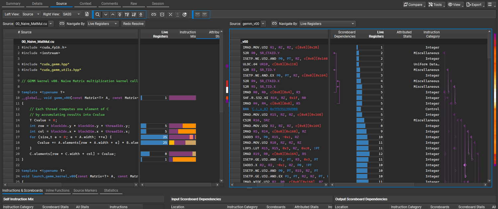

source 页面展示：
| 选项 | 含义 |
| ---- | ---- |
| Live Registers | 活跃寄存器数：查 register pressure |
| Instruction Mix | 指令类型：算/存比例 |
| Attributed Stalls | stall 来源：查卡在哪 |
| Scoreboard Dependencies | 数据依赖：当前指令必须等前一条指令的结果，指令在等谁 |
| Instruction & Scoreboards | 指令级 stall 分解 |
| Inline Functions | inline 展开/寄存器影响 |
| Statistics | 汇总级统计 |

### Context

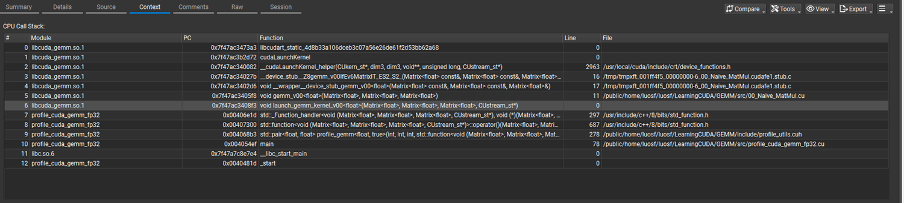

### raw

所有原始数据。

```shell
ncu --import ncu_set_full.ncu-rep --page=raw
```


### session

整个session的配置信息。

```shell
ncu --import ncu_set_full.ncu-rep --page=session
```

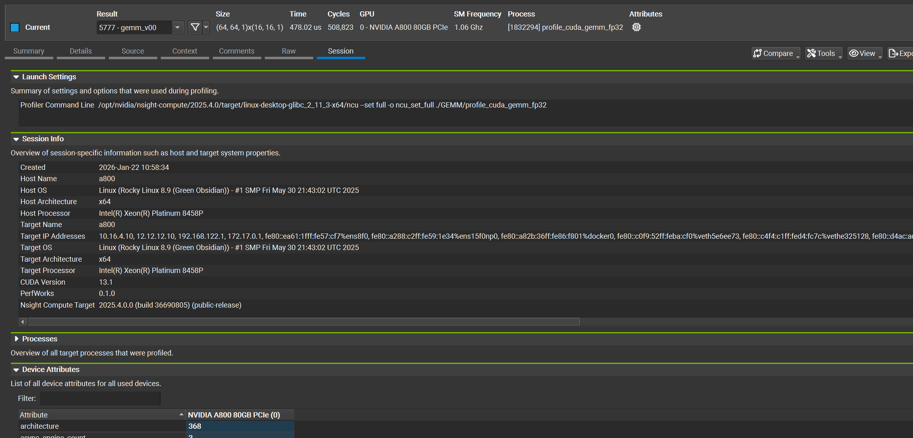