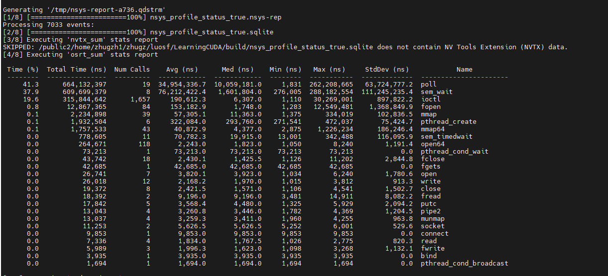
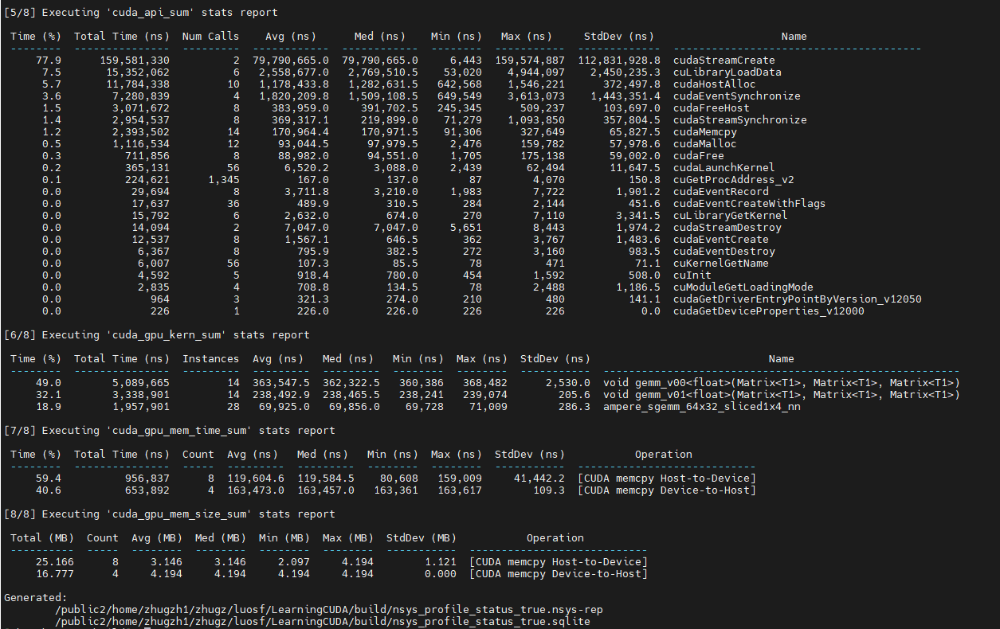
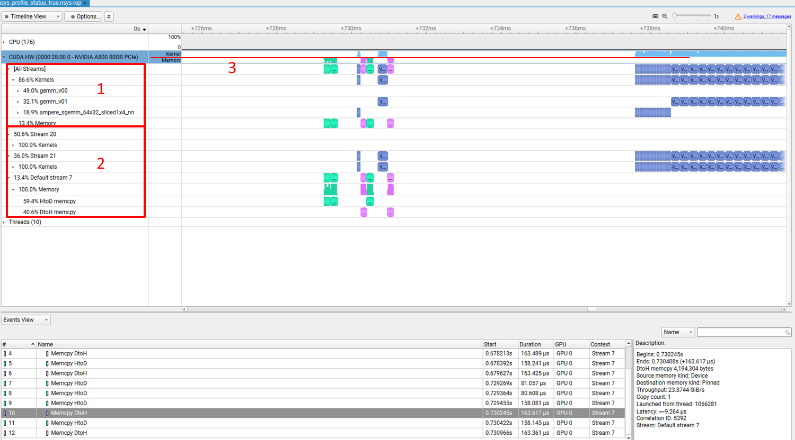
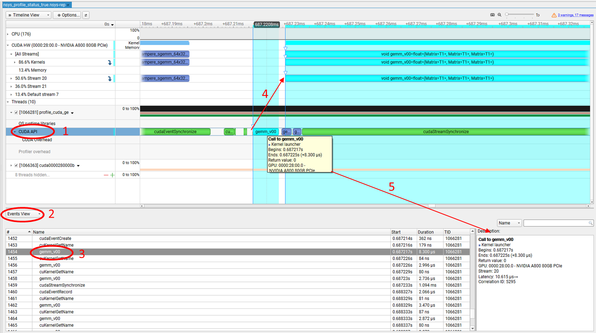
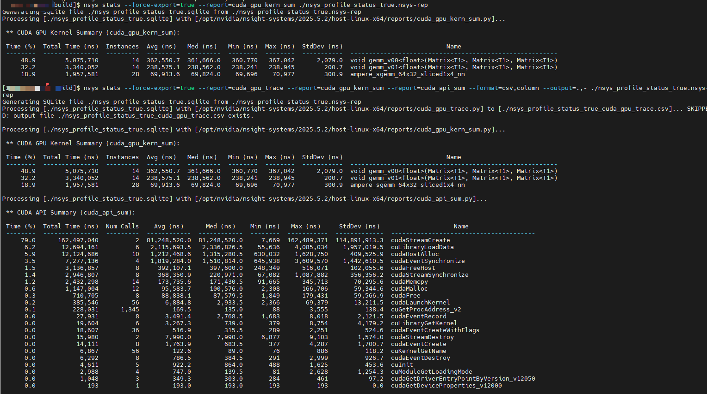
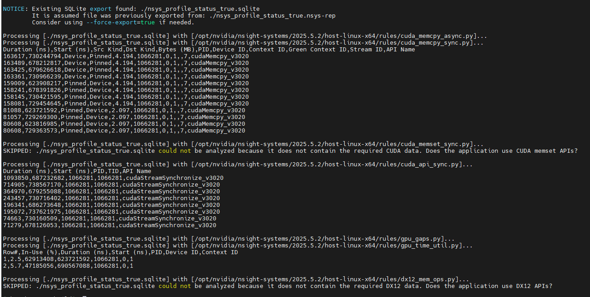
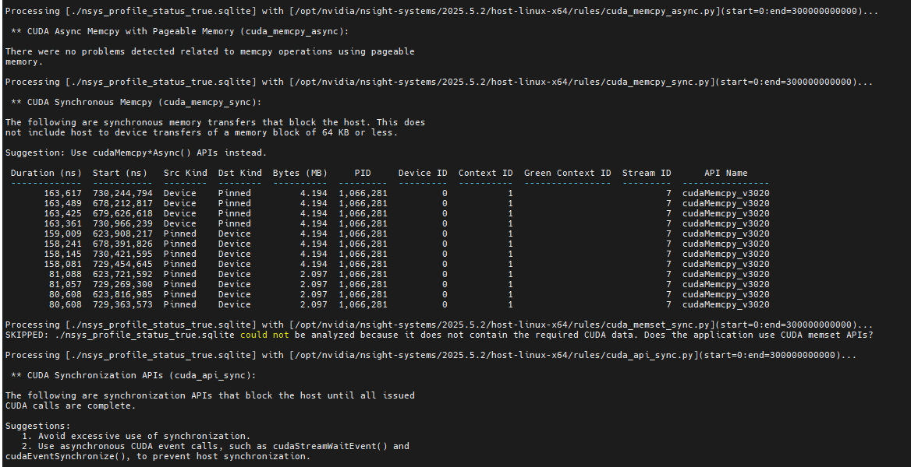
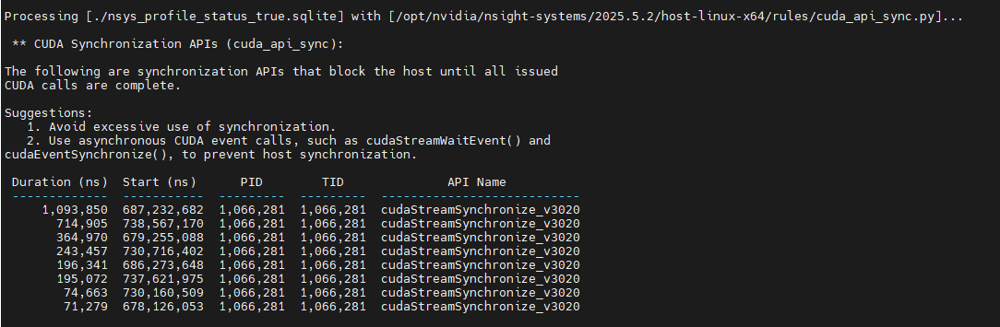

# NVIDIA Nsight Systems

[nsys下载](https://developer.nvidia.com/nsight-systems/get-started)；  [User Guide — Nsight Systems](https://docs.nvidia.com/nsight-systems/UserGuide/index.html)

 **主要功能**

- **时间线视图**：展示CPU、GPU、内存等资源的利用率，帮助开发者识别性能瓶颈。
- **事件追踪**：记录CUDA内核启动、内存拷贝、同步操作等事件，便于分析程序执行流程。
- **多进程支持**：支持同时分析多个进程的性能数据，适用于多线程或多进程应用。

所有命令行选项都是区分大小写的。对于命令开关选项，当使用短选项时，参数应在开关后以空格分隔；例如， `-s process-tree` 。当使用长选项时，开关后应跟一个等号（不跟等号也行），然后是参数；例如， `--sample=process-tree` 。

[相关指令信息](../data/nsys_help)

## profile

> 运行应用程序并将其性能分析捕获到 nsys-rep 文件

| 参数 | 说明 |
|------|------|
| `-b, --backtrace` | 回溯方法：lbr, fp （-fno-omit-frame-pointer）, dwarf（-g）, none，默认lbr |
| `-c, --capture-range` | 捕获范围：none, cudaProfilerApi, nvtx, hotkey |
| `--capture-range-end` | 捕获范围结束行为：none, stop, stop-shutdown, repeat[:N], repeat-shutdown:N |
| `--command-file` | 包含nsys开关的命令文件 |
| `--cpu-core-events` | CPU核心事件采样，使用help查看完整列表 |
| `--cpuctxsw` | CPU上下文切换跟踪：process-tree, system-wide, none |
| `--cuda-event-trace` | 跟踪CUDA事件完成：auto, true, false |
| `--cuda-flush-interval` | CUDA数据刷新间隔（毫秒） |
| `--cuda-graph-trace` | CUDA图跟踪粒度：graph/node[:host-only/host-and-device] |
| `--cuda-memory-usage` | 跟踪GPU内存使用：true, false |
| `--cuda-trace-all-apis` | 跟踪所有CUDA API：true, false |
| `--cuda-um-cpu-page-faults` | 跟踪统一内存CPU页错误：true, false |
| `--cuda-um-gpu-page-faults` | 跟踪统一内存GPU页错误：true, false |
| `--cudabacktrace` | CUDA API回溯收集：all,none,kernel,memory,sync,other |
| `-d, --duration` | 采集持续时间（秒），默认0 |
| `--dask` | Dask跟踪：functions-trace, none |
| `--debug-symbols` | 符号文件目录路径（冒号分隔） |
| `--duration-frames` | 停止前捕获的帧数，最小60 |
| `-e, --env-var` | 设置环境变量，格式：A=B,C=D |
| `--event-sample` | 事件采样：system-wide, none |
| `--event-sampling-interval` | 事件采样间隔（毫秒），默认10 |
| `--export` | 导出格式：none, sqlite, hdf, text, json, arrow, arrowdir, parquetdir |
| `-f, --force-overwrite` | 覆盖现有文件：true, false |
| `--flush-on-cudaprofilerstop` | cudaProfilerStop时刷新缓冲区：true, false |
| `--ftrace` | 收集ftrace事件，格式：subsystem1/event1,subsystem2/event2 |
| `--ftrace-keep-user-config` | 保持用户ftrace配置：true, false |
| `--gpu-metrics-devices` | GPU指标设备：none, cuda-visible, all, 或GPU ID列表 |
| `--gpu-metrics-frequency` | GPU指标采样频率（Hz），默认10000 |
| `--gpu-metrics-set` | GPU指标集别名，使用help查看 |
| `--gpu-video-device` | GPU视频加速器跟踪设备 |
| `--gpuctxsw` | 跟踪GPU上下文切换：true, false |
| `--hotkey-capture` | 热键触发：F1-F12，默认F12 |
| `--ib-net-info-devices` | InfiniBand NIC名称列表 |
| `--ib-net-info-files` | ibdiagnet db_csv文件路径列表 |
| `--ib-net-info-output` | ibdiagnet网络发现数据输出目录 |
| `--kill` | 终止信号：none, sigkill, sigterm, 或信号号 |
| `--mpi-impl` | MPI实现：openmpi, mpich |
| `-n, --inherit-environment` | 继承环境变量：true, false，默认true |
| `--nic-metrics` | 收集NIC/HCA指标：true, false |
| `--nvtx-domain-include` | NVTX域包含列表 |
| `--nvtx-domain-exclude` | NVTX域排除列表 |
| `-o, --output` | 输出报告文件名，支持%q{ENV}, %h, %p, %n, %% |
| `--opengl-gpu-workload` | 跟踪OpenGL GPU负载：true, false |
| `--os-events` | OS事件采样，使用help查看完整列表 |
| `--osrt-backtrace-stack-size` | OS运行时回溯栈大小（字节），默认6144 |
| `--osrt-backtrace-threshold` | OS运行时回溯阈值（纳秒），默认80000 |
| `--osrt-threshold` | OS运行时API阈值（纳秒），默认1000 |
| `-p, --nvtx-capture` | NVTX捕获范围：range@domain, range, range@* |
| `--python-backtrace` | Python回溯收集：cuda, none |
| `--python-functions-trace` | Python函数跟踪JSON文件路径 |
| `--python-sampling` | Python回溯采样：true, false |
| `--python-sampling-frequency` | Python采样频率（Hz），默认1000 |
| `--pytorch` | PyTorch跟踪：autograd-nvtx, autograd-shapes-nvtx, functions-trace, none |
| `--resolve-symbols` | 解析符号：true, false |
| `--run-as` | 以指定用户身份运行 |
| `-s, --sample` | CPU采样：process-tree, system-wide, none |
| `--samples-per-backtrace` | 每个回溯的CPU样本数，默认1 |
| `--sampling-period` | 采样周期，默认1350496 |
| `--session-new` | 启动新的命名会话 |
| `--start-frame-index` | 开始帧索引，最小1 |
| `--stats` | 采集后生成统计信息：true, false |
| `-t, --trace` | 要跟踪的API：cuda, cuda-hw, nvtx, cublas, cublas-verbose, cusolver, cusolver-verbose, cusparse, cusparse-verbose, mpi, oshmem, ucx, osrt, cudnn, opengl, opengl-annotations, openacc, openmp, nvvideo, vulkan, vulkan-annotations, python-gil, gds, none |
| `--trace-fork-before-exec` | fork后exec前跟踪：true, false |
| `--vulkan-gpu-workload` | Vulkan GPU负载跟踪：individual, batch, none, true, false |
| `-w, --show-output` | 显示进程输出：true, false |
| `--wait` | 等待进程终止：primary, all，默认all |
| `-x, --stop-on-exit` | 应用退出时停止分析：true, false |
| `-Y, --start-later` | 延迟启动直到nsys start执行：true, false |
| `-y, --delay` | 采集开始延迟（秒），默认0 |

```shell
# 基础采集，生成统计信息
nsys profile --stats=true -o nsys_profile_status_true ./GEMM/profile_cuda_gemm_fp32

# 追踪CUDA和NVTX API，采集20秒，不收集CPU采样和上下文切换
nsys profile --trace=cuda,nvtx -d 20 --sample=none --cpuctxsw=none \
    -o nsys_profile_trace_d_sample_cpuctxsw ./GEMM/profile_cuda_gemm_fp32

# 设置环境变量，0.1秒后开始采集
nsys profile -e TEST_ONLY=0 -y 0.1 -o nsys_profile_e_y_0_1 ./GEMM/profile_cuda_gemm_fp32

# 系统级分析：ftrace+OS事件+上下文切换（需root权限）
# sudo cat /sys/kernel/debug/tracing/available_events 查看fptrace event
sudo nsys profile --ftrace=drm/* --event-sample=system-wide --os-events=cpu-clock \
	--cpuctxsw=system-wide -d 20 \
    -o nsys_profile_ftrace ./GEMM/profile_cuda_gemm_fp32

# GPU指标采集，20kHz频率 （需root权限）
nsys profile --gpu-metrics-devices=all --gpu-metrics-frequency=20000 \
    --gpu-metrics-set=ga100 -o nsys_profile_gpu_metrics ./GEMM/profile_cuda_gemm_fp32

# 系统级CPU采样（需root权限）
sudo nsys profile --sample=system-wide -d 5 -o nsys_profile_system_sample ./GEMM/profile_cuda_gemm_fp32

# 性能调优：CPU采样+回溯 默认lbr只能看Bottom-Up View，设置--backtrace=dwarf后可以看Top-Down和Flat
nsys profile  --sample=process-tree --backtrace=lbr \
  	-o nsys_profile_gpu_sample_backtrace ./GEMM/profile_cuda_gemm_fp32
  	
# 统一内存诊断：CPU+GPU页错误跟踪
nsys profile --cuda-memory-usage=true --cuda-um-cpu-page-faults=true --cuda-um-gpu-page-faults=true -o nsys_profile_memory_cudaum ./GEMM/profile_cuda_gemm_fp32

# 获取网卡指标
nsys profile --nic-metrics=true -o nsys_profile_nic ./GEMM/profile_cuda_gemm_fp32

# 获取InfiniBand 交换机性能指标 (root) sudo ibswitches -C <nic name>
nsys profile --ib-switch-metrics-devices=<IB switch GUID> my_app
# 多框架分析：Python+PyTorch+Dask

# 精确捕获范围区域
nsys profile \
  -t cuda,nvtx,cublas \  # 跟踪CUDA/BLAS/NVTX标记
  --capture-range=cudaProfilerApi \  # 仅抓取profiler区间,避免记录初始化耗时
  --force-overwrite=true \  # 一般-o后可能多次运行需要覆盖旧文件
  -o nsys_profile_range_report \     # 输出文件名
  ./demo

nsys profile -y 2 -d 5 ./demo  # 跳过前2秒，抓取5秒数据
```





nsys常用快捷按键：

> （crtl+双击鼠标左键会跳转过去）Timeline VIew  -> Events View
>
> （shift+双击鼠标左键会跳转过去）Events View  -> Timeline VIew
>
> 过滤区域：鼠标左键选择一块timeline区域然后 右键选择Filter 后续右键移除该filter即可。
>
> 鼠标悬浮看具体的信息，比如Threads里黑色：CPU利用率，黄色：采样点；绿色：运行

Analysis Summar 展示的是分析概要，包含指令配置，CPU，GPU， NIC网格信息,环境变量等信息。

常用Timeline View：可视化所有事件的时间序列。右上角+-可放大缩小。缩小后高度表示百分比利用率

Events VIew： 以表格形式列出所有采集到的原始事件，支持排序。

Stats System View:：按类别汇总的性能计数器和统计信息

- **典型子表**：
  - **CUDA API Statistics**：各 API 调用次数、总耗时
  - **GPU Kernel Statistics**：每个 kernel 的平均/最大/最小执行时间、寄存器使用、共享内存
  - **Memory Copy Statistics**：H2D/D2H/P2P 的总字节数、带宽
  - **OS Runtime**：`malloc`, `pthread_create` 等系统调用统计
  - **NIC Metrics**（如果启用）：收发包数、带宽

Bottom-Up View：从最底层向上聚合 CPU 采样时间，支持展开调用链：**快速定位热点函数**

Top-Down View：从根函数（如 `main`）向下展开调用树：**理解程序控制流与时间分布**

Flat View：所有函数的去重列表，不显示调用关系



图1是所有流的设备端活动，2是具体的流的设备端活动，3显示的kernel和memory的整体timeline，这样即使不细看设备端具体的执行操作，也能根据该timeline看GPU的利用率。



点击1中 CUDA API，然后右键点击`Show in Events View`，可以看到API相关信息，也可以手动选择`Events View`打开：

点击其中一项比如3位置的kernel，双击显示4中的箭头对应着API和设备kernel事件的联系。鼠标悬浮可以看到API的描述的trace信息。在5中Events VIew中信息一致,kernel 也同样可以看到附加的设备端信息。

点击kernel鼠标右键可以查看ncu指令，运行相关指令去分析kernel，也可以右键copy ToolTip 拷贝trace信息。

==**后续launch-service间的option command里，和profile相同的子命令不在显示赘述。**==

## Interactive CLI (多终端)

### launch

> 启动待分析应用程序（用于交互式分析）

| 参数 | 说明 |
|------|------|
| `--session` | 在指定会话中启动 |

### start

> 开始分析会话,

### stop

> 停止分析会话并捕获数据

| 参数 | 说明 |
|------|------|
| `--keep` | 保留停止前N秒的数据 |

### cancel

> 取消分析会话并丢弃数据
> 

### shutdown

> 断开进程并关闭分析会话

| 参数 | 说明 |
|------|------|
| `-h, --help` | 打印帮助 |
| `--kill` | 发送信号：none, sigkill, sigterm, 或信号号 |
| `--session` | 关闭指定会话 |

### session list

> 列出活动会话

```shell
nsys sessions list
```

```shell
# 启动至手动结束
nsys start --stop-on-exit=false
nsys launch --trace=cuda ./GEMM/profile_cuda_gemm_fp32
nsys stop

# 手动开始收集，持续运行直至进程结束  
nsys launch -w true ./GEMM/profile_cuda_gemm_fp32
nsys start  

# 运行应用程序，命名会话，只保留最后几秒
nsys start --session-new=%q{USER}
nsys launch --session=%q{USER} ./GEMM/profile_cuda_gemm_fp32
nsys stop --session=%q{USER} --keep=3

# 使用 cudaProfilerStart/Stop 开始/停止收集 (单终端)
# 等同于nsys profile --capture-range=cudaProfilerApi ./demo
nsys start -c cudaProfilerApi
nsys launch -w true ./demo

# 多次采集
nsys launch <application> [application-arguments]
nsys start
nsys stop
nsys start
nsys stop
nsys shutdown --kill sigkill
```

## service

> 启动Nsight Systems数据服务

```shell
nsys service
```

## stats

> 从现有的 nsys-rep 或 SQLite 文件生成统计报告

| 参数 | 说明 |
|------|------|
| `-f, --format` | 输出格式：column,table,csv,tsv,json,hdoc,htable |
| `--filter-nvtx` | 按NVTX范围过滤 |
| `--filter-time` | 按时间范围过滤 |
| `--force-export` | 强制重新导出SQLite |
| `--force-overwrite` | 覆盖输出文件 |
| `--help-formats` | 显示格式帮助 |
| `--help-reports` | 显示报告帮助 |
| `-o, --output` | 输出机制 |
| `-q, --quiet` | 仅显示错误 |
| `-r, --report` | 指定报告，默认多个报告 |
| `--report-dir` | 报告脚本搜索路径 |
| `--sqlite` | 指定SQLite文件 |
| `--timeunit` | 设置时间单位 |

**默认报告集：**
nvtx_sum, osrt_sum, cuda_api_sum, cuda_gpu_kern_sum, cuda_gpu_mem_time_sum, cuda_gpu_mem_size_sum, openmp_sum, opengl_khr_range_sum, opengl_khr_gpu_range_sum, vulkan_marker_sum, vulkan_gpu_marker_sum, dx11_pix_sum, dx12_gpu_marker_sum, dx12_pix_sum, wddm_queue_sum, um_sum, um_total_sum, um_cpu_page_faults_sum, openacc_sum, syscall_sum

```shell
# 导出一种报告
nsys stats --force-export=true --report=cuda_gpu_kern_sum ./nsys_profile_status_true.nsys-rep
# 导出多种报告，多种格式，三种report，对应format格式三种，现在提供两种格式输出，匹配方法重复最后一种格式用于对齐
nsys stats --force-export=true --report=cuda_gpu_trace --report=cuda_gpu_kern_sum --report=cuda_api_sum --format=csv,column --output=.,- ./nsys_profile_status_true.nsys-rep
# 过滤显示
nsys stats --report cuda_api_sum --format table \
--output @"grep -E (-|Name|cudaFree)" ./nsys_profile_status_true.sqlite
```



## status

> 报告基于CLI的采集任务状态或分析环境的适配情况

| 参数 | 说明 |
|------|------|
| `--all` | 打印所有可用分析环境的信息 |
| `-e, --environment` | 检查系统的分析环境 |
| `-n, --network` | 检查网络的分析环境 |
| `--session` | 打印指定会话的状态 |

```shell
nsys status --environment
```


## export

> 从现有的.nsys-rep文件生成导出文件

| 参数 | 说明 |
|------|------|
| `--append` | 追加到现有文件（用于目录输出格式） |
| `-f, --force-overwrite` | 覆盖现有文件：true, false |
| `-h, --help` | 打印帮助 |
| `--include-blobs` | 导出NVTX扩展负载为二进制数据：true, false |
| `--include-json` | 包含重复JSON块：true, false |
| `-l, --lazy` | 延迟表创建：true, false |
| `-o, --output` | 输出文件路径 |
| `-q, --quiet` | 不显示进度条：true, false |
| `--separate-strings` | 单独输出字符串：true, false |
| `-t, --type` | 导出格式：sqlite, hdf, text, json, info, arrow, arrowdir, parquetdir |
| `--tables` | 匹配模式的表（正则表达式） |
| `--times` | 时间范围过滤 |

```shell
nsys export --type=sqlite ./report.nsys-rep

# 多节点时间线对齐
nsys export --sync-timeline 
```

## analyze

> 根据生成的profile文件处理,生成优化建议报告

| 参数 | 说明 |
|------|------|
| `-f, --format` | 输出格式：column,table,csv,tsv,json,hdoc,htable |
| `--filter-nvtx` | 按NVTX范围过滤事件和时间记录 |
| `--filter-time` | 按时间范围过滤事件 |
| `--force-export` | 强制重新导出SQLite |
| `--force-overwrite` | 覆盖输出文件 |
| `-h, --help` | 打印帮助菜单 |
| `--help-formats` | 显示输出格式帮助 |
| `--help-rules` | 显示规则帮助 |
| `-o, --output` | 指定输出机制：控制台(-)、文件路径、或命令(@command) |
| `-q, --quiet` | 仅显示错误信息 |
| `-r, --rule` | 指定分析的规则，可逗号分隔多种规则 |
| `--sqlite` | 指定SQLite导出文件名 |
| `--timeunit` | 设置时间单位 |

```shell
nsys analyze -f csv ./nsys_profile_status_true.nsys-rep # 生成csv文件
```



```shell
nsys analyze --filter-time=0m/5m ./nsys_profile_status_true.nsys-rep # 过滤时间范围
```



```shell
nsys analyze --sqlite aaa.sqlite ./nsys_profile_status_true.nsys-rep # 导出sqlite文件
```

```shell
nsys analyze -r cuda_api_sync ./nsys_profile_status_true.nsys-rep # 指定规则输出
```



## recipe

> 多个文件进行后处理，常见于多节点分析。依赖python版本。

**可用配方：**
cuda_api_sum, cuda_api_sync, cuda_gpu_kern_hist, cuda_gpu_kern_pace, cuda_gpu_kern_sum, cuda_gpu_mem_size_sum, cuda_gpu_mem_time_sum, cuda_gpu_time_util_map, cuda_memcpy_async, cuda_memcpy_sync, cuda_memset_sync, diff, dx12_mem_ops, gfx_hotspot, gpu_gaps, gpu_metric_util_map, gpu_metric_util_sum, gpu_time_util, mpi_gpu_time_util_map, mpi_sum, nccl_gpu_overlap_trace, nccl_gpu_proj_sum, nccl_gpu_time_util_map, nccl_sum, network_map_aws, network_sum, network_traffic_map, nvlink_sum, nvtx_cpu_topdown, nvtx_gpu_proj_pace, nvtx_gpu_proj_sum, nvtx_gpu_proj_trace, nvtx_pace, nvtx_sum, osrt_sum, storage_util_map, ucx_gpu_time_util_map

```shell
nsys recipe cuda_gpu_kern_sum ./report.nsys-rep
```

## nvprof

> 提供从nvprof迁移到nsys的转换

```shell
nsys nvprof [nvprof选项] ./your_program
```

```shell
nsys nvprof ./GEMM/profile_cuda_gemm_fp32
nsys nvprof --print-api-trace --print-gpu-trace ./GEMM/profile_cuda_gemm_fp32
nsys nvprof  --metrics achieved_occupancy ./GEMM/profile_cuda_gemm_fp32
```
---

## 常用分析流程

```shell
# 1. 采集分析数据
nsys profile --stats=true -o my_report ./my_application

# 2. 查看统计信息
nsys stats my_report.nsys-rep

# 3. 导出SQLite进行深度分析
nsys export --type=sqlite my_report.nsys-rep

# 4. 使用analyze生成优化建议
nsys analyze -f column -r gpu_time_util,cuda_api_sync my_report.nsys-rep

# 5. 使用GUI查看时间线
nsys-ui my_report.nsys-rep
```
